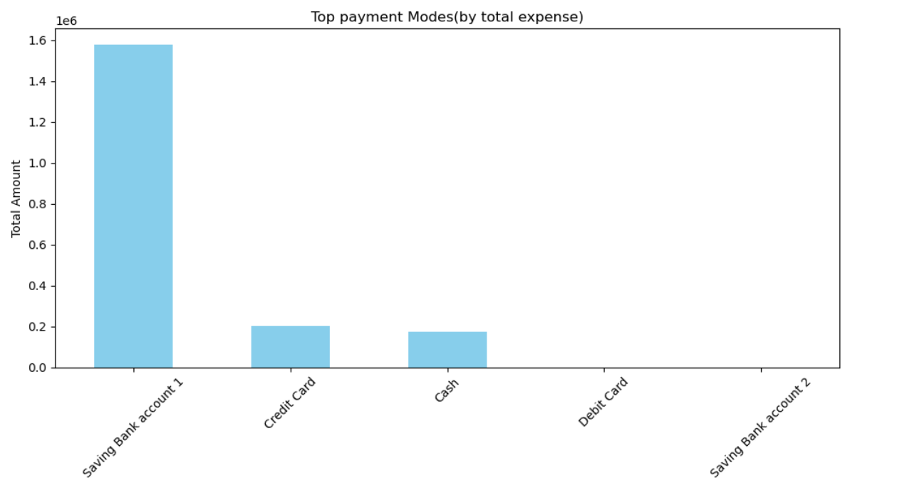

# Daily Transaction Analysis

This project provides a detailed analysis of daily transaction data using Python and Jupyter Notebook. It includes data cleaning, exploratory data analysis (EDA), time-series trends, and visualizations to help uncover patterns in transaction behavior.

## Features

- Load and clean transaction datasets
- Aggregate and analyze transaction volume
- Visualize daily and cumulative transaction trends
- Identify peak transaction dates
- Detect anomalies or unusual activity

## Technologies Used

- Python 3
- Jupyter Notebook
- Pandas
- Matplotlib
- Seaborn
- NumPy

## Screenshots

